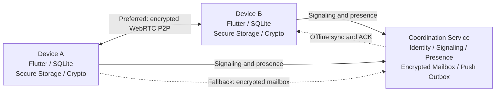

# Simple Communication

<p align="center">
  
</p>

<p align="center">
  <a href="README.md">繁體中文</a> · <strong>English</strong>
</p>

<p align="center">
  
  
  
  
  <a href="https://github.com/leezxt/p2p-chat/actions/workflows/v1-ci.yml"></a>
  
</p>

A clean, private, and cost-conscious modular P2P messaging project.

Modern messengers increasingly combine social feeds, short videos, shopping,
games, and advertising. Simple Communication returns the product to its original
job: direct conversation. Its first release focuses on one-to-one text messaging,
with privacy, low resource usage, and low server cost treated as architectural
defaults rather than optional features.

This is a solo project developed by **leezxt** since
July 12, 2026. It serves as a graduation project, engineering case study, and
software-development portfolio.

## Product principles

1. **Mobile first** — background apps release WebRTC connections and rely on
   push notifications or offline synchronization.
2. **Private by default** — plaintext conversations and plaintext private keys
   are never stored on the server.
3. **Modular by design** — the Core does not depend on individual feature
   modules; cross-module communication uses an Event Bus.
4. **Cost-aware infrastructure** — the backend is limited to identity,
   signaling, presence, encrypted mailbox storage, and push outbox delivery.

The goal is not merely to ship fewer features. Every feature must justify its
user value, resource cost, and privacy boundary.

## Use cases

### Private communication

- End-to-end message content belongs to the communicating devices.
- Secure key storage and Safety Numbers help users verify peer identity.
- Designed for users who value clear content ownership and privacy boundaries.

### Low-cost community messaging

- Real-time messages prefer P2P transport to reduce centralized traffic.
- Presence updates are intentionally infrequent.
- The encrypted mailbox is used only when direct delivery is unavailable.

### Personal cross-device communication

- Flutter provides a mobile-first application with desktop support.
- Modules implement `init / activate / sleep / dispose` lifecycles.
- The Desktop Link host safety core persists an explicit mobile authorization,
  device fingerprint, and sync cutoff. It selects only messages created after
  that cutoff and rejects new selections immediately after revocation.
- The mobile side can review a short-lived, one-time, versioned QR pairing
  request. It must target this primary device, and a link is created only after
  an explicit user approval. SQLite v14 stores one-time handling state, while
  SQLite v15 binds the QR's public X25519 key to its fingerprint; neither
  stores the raw QR payload.
- QR content remains **untrusted input**. There is no desktop private-key
  possession signed challenge, desktop transport, per-device encryption, or
  real camera/Desktop runtime validation yet. This does not claim working
  cross-device sync, verified desktop identity, or deletion of a previously
  linked device's key material.

## App screenshots

These screens were captured from a complete debug APK running on an Android API
35 emulator, including the real sodium native asset. They are emulator evidence,
not a substitute for validation on two physical Android devices.

| Dark home | Low Power Mode | App Lock |
|---|---|---|
|  |  |  |

[▶ Watch the 34-second Android demo](docs/media/simple-communication-android-demo.mp4)

## Architecture

Endpoints own message content, local data, device keys, and cryptographic
operations. The coordination service helps peers connect and temporarily stores
ciphertext when a direct P2P session cannot be established.



Message delivery follows four steps:

1. Persist the encrypted message to local SQLite.
2. Attempt authenticated signaling and a WebRTC DataChannel.
3. Fall back to the encrypted Offline Mailbox when P2P delivery fails.
4. Complete the `STORED → DELIVERED → READ` acknowledgement loop.

This makes short disconnections, app restarts, and lost acknowledgements
recoverable without showing duplicate messages.

## Development history

| Date | Stage | Outcome |
|---|---|---|
| 2026-07-12 | Core foundation | Flutter Core, SQLite chat, Java backend |
| 2026-07-13–14 | Messaging loop | Identity, WebRTC P2P, Offline Mailbox and ACK |
| 2026-07-15–16 | Security and efficiency | Secure key storage, Presence, Push Outbox |
| 2026-07-17–18 | V1.5 capabilities | Low Power Mode, App Lock, Safety Number |
| 2026-07-19 | Release engineering | Backup/Restore, Monitor/Alert, RC documentation |
| 2026-08-09 | V3 safety foundation | Desktop Link authorization, new-message cutoff, revoke gate, one-time QR pairing-request review, and public-key binding |

Each stage is expected to remain buildable, testable, and reversible.

## Current evidence

### Implemented and validated

- Authenticated encrypted P2P and mailbox acknowledgement loop on two Android AVDs.
- Java tests, Flutter automated tests, and PostgreSQL smoke tests.
- Core Low Power Mode, App Lock, and Safety Number capabilities.
- Desktop Link host safety core: SQLite v13 authorization state, SQLite v14
  one-time pairing-request state, SQLite v15 public-key/fingerprint binding,
  explicit mobile approval, strict new-message cutoff, and fail-closed
  revocation. A reviewed QR request never authorizes a link automatically and
  is not private-key-possession proof.
- Production backup, restore, monitoring, alerting, and off-host export fixtures.
- GitHub Actions for Java, Flutter, PostgreSQL, and Windows Desktop.

### Implemented but awaiting production evidence

- Two physical Android devices, real network loss, OS kill, and ACK recovery.
- Physical-device startup time, memory, background traffic, and battery tests.
- Real FCM/APNs delivery and iPhone runtime validation.
- Production Android application ID, keystore, iOS Bundle ID, and signing.
- Public HTTPS/WSS, registry digest, scheduled monitoring, external alerts,
  and an off-host restore drill.
- A desktop-side pairing requester, private-key-possession signed challenge,
  real camera scan validation, desktop transport, per-device re-encryption,
  cross-device history/new-message sync, and validation that revocation removes
  access to new messages on a companion device.

The current build remains an **internal Android test build**. It is not presented
as a public V1 release candidate until the remaining release gates are complete.

## Repository structure

```text
p2p-chat/
  ├─ mobile_desktop_app/   Flutter mobile primary client and desktop companion
  ├─ java_backend/         Spring Boot signaling, mailbox, and administration
  ├─ cloudflare_worker/    Future low-cost edge implementation
  └─ docs/                 Architecture, protocol, security, and operations
```

The current Desktop Link safety boundary and the remaining protocol/runtime work
are described in [`docs/desktop_link.md`](docs/desktop_link.md).

## Quick start

Requirements: Flutter 3.44 or newer, Dart 3.12 or newer, Java 21, and Docker for
the backend integration environment.

```bash
cd mobile_desktop_app
flutter pub get
flutter run
flutter test
dart analyze
```

See [testing](docs/testing.md), [architecture](docs/architecture.md),
[project tasks](docs/project_tasks.md), and the
[release candidate gates](docs/release_candidate_v1.md) for detailed evidence
and limitations.
