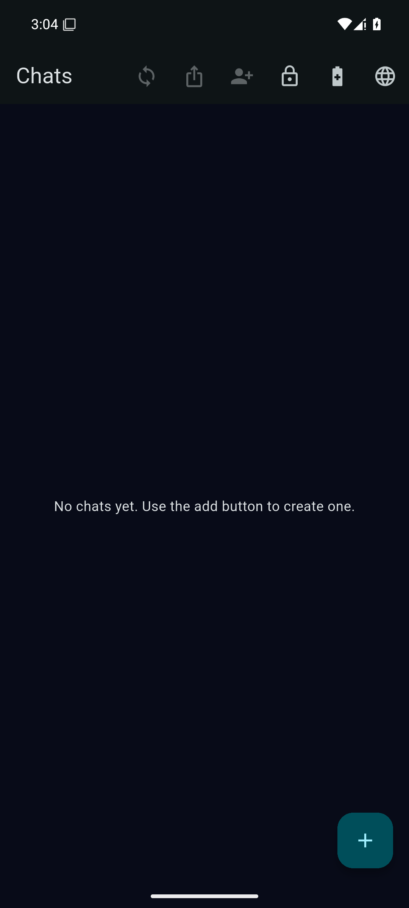
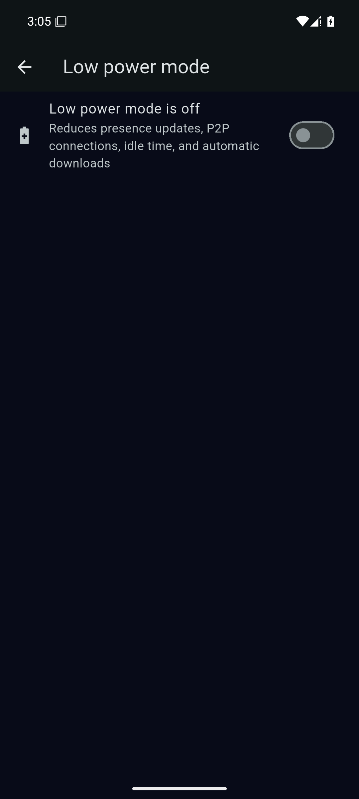
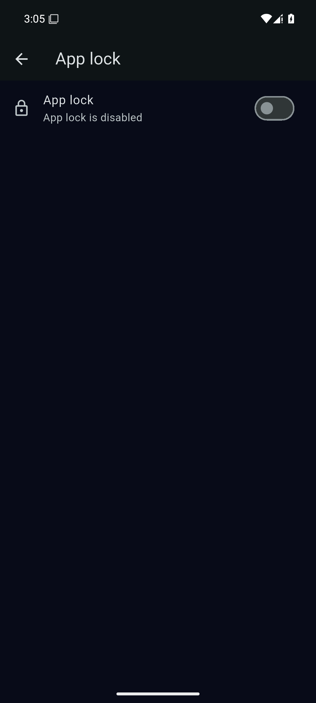
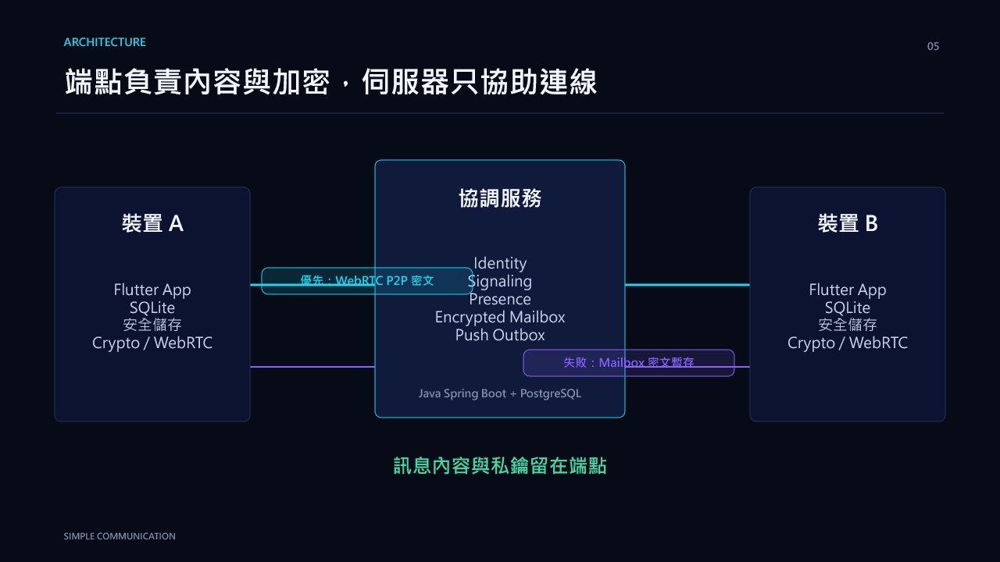
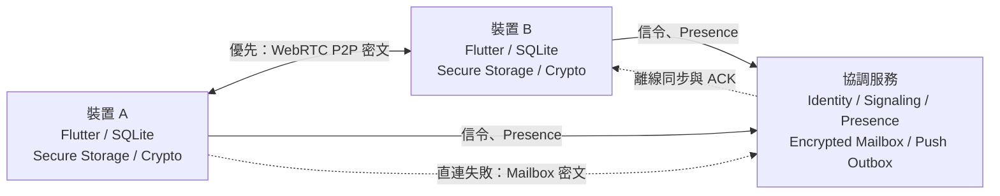

# Simple Communication

<p align="center">
  
</p>

<p align="center">
  <strong>繁體中文</strong> · <a href="README.en.md">English</a>
</p>

<p align="center">
  
  
  
  
  <a href="https://github.com/leezxt/p2p-chat/actions/workflows/v1-ci.yml"></a>
  
</p>

一個乾淨、私密、低成本的模組化 P2P 通訊專案。

目前市場上的通訊軟體逐漸加入社群、短影音、購物、遊戲與廣告等功能，
使單純的溝通被複雜介面和商業內容干擾。Simple Communication 希望將通訊重新做成
一項安靜的基礎服務：以 1 對 1 文字訊息為核心，讓隱私、低資源與低伺服器成本成為
架構預設，而不是事後補上的選項。

本專案由 **leezxt** 開發，自 2026-07-12 開始設計與實作，作為畢業專題、
專案成果報告與軟體工程面試作品。

依據《P2P Modular Messenger Codex 開發總規格 v1.2》建置。核心原則：
**先核心、後模組；先手機、後電腦；先文字、後影音；先低資源、後高功能。**

## 產品定位

Simple Communication 不是要複製 LINE、WhatsApp 或 Discord，而是以四項約束控制產品方向：

1. **手機優先**：App 進入背景後不維持 WebRTC 長連線，改以推播與離線同步喚醒。
2. **隱私預設**：聊天內容不以明文上傳伺服器，裝置私鑰不以明文保存。
3. **模組化**：Core 不直接依賴單一功能；跨模組溝通透過 Event Bus。
4. **成本可控**：Backend 只承擔身份、信令、Presence、離線 Mailbox 與 Push Outbox。

核心不是單純減少功能，而是要求每個新增功能都能證明其價值、資源成本與隱私邊界。

## 應用場景

### 隱私通訊

- 訊息內容由通訊雙方持有，不依賴平台保存明文。
- 使用端點加密、安全儲存與 Safety Number 進行身份核對。
- 適合重視內容所有權與隱私邊界的個人使用者。

### 低成本社群通訊

- 即時訊息優先採 P2P 傳輸，降低中央伺服器流量。
- Presence 採低頻更新；Mailbox 在前景啟動／返回時立即同步，之後一般模式每 60 秒、Low Power 每 5 分鐘同步一次，進背景即停止（背景以 Push 與手動同步保底）。
- 適合沒有大型平台基礎設施預算的小型團體與社群。
- Storage Manager 提供本機資料庫／快取／附件分類與預覽式快取清理；身份、金鑰、聊天與未送訊息不會被清除。

### 跨裝置個人通訊

- Flutter App 以手機為主要端點，Desktop 作為按需延伸。
- 模組具有 `init / activate / sleep / dispose` 生命週期，避免高耗能能力常駐。
- 後續規劃包含 Desktop Link、裝置撤銷與新訊息同步。

## App 畫面

以下畫面來自 Android API 35 模擬器上的完整 debug APK，包含真實 sodium native
asset；這是模擬器執行證據，不取代兩台 Android 真機驗收。

| 深色首頁 | Low Power Mode | App Lock |
|---|---|---|
|  |  |  |

[▶ 查看 34 秒 Android 操作 Demo](docs/media/simple-communication-android-demo.mp4)

## 系統架構

端點負責訊息內容、本機資料、金鑰與加解密；伺服器只協助雙方建立連線，
並在無法 P2P 直連時暫存密文。





訊息傳遞流程：

1. 訊息先寫入本機 SQLite，再進入傳輸佇列。
2. 透過 authenticated signaling 建立 WebRTC DataChannel。
3. P2P 失敗時，將密文送入 Offline Mailbox。
4. 以 `STORED → DELIVERED → READ` 完成 ACK 閉環；ACK 遺失時可冪等重送。

因此短暫斷線、App 重啟或 ACK 遺失不會直接造成訊息遺失或重複顯示。

## 開發沿革

| 日期 | 階段 | 主要成果 |
|---|---|---|
| 2026-07-12 | 核心成立 | Flutter Core、SQLite 聊天、Java Backend |
| 2026-07-13～14 | 通訊閉環 | Identity、WebRTC P2P、Offline Mailbox 與 ACK |
| 2026-07-15～16 | 安全與低功耗 | 加密儲存、Presence、Push Outbox |
| 2026-07-17～18 | V1.5 能力 | Low Power Mode、App Lock、Safety Number |
| 2026-07-19 | 發布工程 | Backup／Restore、Monitor／Alert、RC 文件 |

每個階段均以「可編譯、可測試、可回退」為完成原則，並同步更新測試與交接文件。

## 目前成果與驗證邊界

### 已完成並驗證

- Android 雙 AVD 的 authenticated encrypted P2P 與 Mailbox ACK 閉環。
- Java 52 項測試、Flutter 自動化測試與 PostgreSQL smoke。
- Low Power Mode、App Lock 與 Safety Number 核心功能。
- Production Backup／Restore、Monitor／Alert 與 off-host export fixtures。
- GitHub Actions 的 Java、Flutter、PostgreSQL 與 Windows Desktop 工作。

### 已實作、仍待正式環境驗證

- 兩台 Android 真機 E2E、實際斷網、OS kill 與 ACK 遺失恢復。
- 真機冷啟動、記憶體、背景網路與長時間耗電。
- 真實 FCM／APNs、Android 系統通知與 iPhone runtime。
- 正式 Android application ID、keystore、iOS Bundle ID 與 distribution signing。
- 公開 HTTPS/WSS、registry digest、正式排程、外部告警與 off-host restore drill。

目前定位仍是**內部 Android 測試版**；上述 Gate 完成前不對外宣稱正式 V1 RC。

## Monorepo 結構

```text
p2p-chat/
  ├─ mobile_desktop_app/   Flutter 手機主端 + Desktop 副端（Dart）
  ├─ java_backend/         Java Spring Boot 原型後端（signaling / mailbox / admin）
  ├─ cloudflare_worker/    低成本 signaling / invite code / mailbox（後續）
  └─ docs/                 架構、訊息 schema、安全、成本說明
```

## 開發順序（Stage / Sprint）

本專案嚴格依規格 §22 執行順序推進，每個 Sprint 完成後保持「可編譯、可測試、可回退」。

| Sprint | 內容 | 狀態 |
|---|---|---|
| 0 | Repo 與規範初始化 | ✅ 已完成 |
| 1 | Flutter Core 架構（Module / EventBus / Registry / Service） | ✅ 已完成 |
| 2 | SQLite 與本機聊天 UI | ✅ 已完成 |
| 3 | Java Spring Boot 原型後端 | ✅ 已完成（Docker Compose + PostgreSQL smoke test 通過） |
| 4 | Identity / Contact / Device 整合 | ✅ Android 雙 AVD 邀請、雙向聯絡人同步與公鑰信任通過 |
| 5 | Signaling 與 WebRTC P2P | 🚧 Android 雙 AVD authenticated encrypted E2E 通過；Desktop/資源驗收待補 |
| 6 | Crypto 與安全儲存 | 🚧 Android 實作與 runtime 驗證完成；iPhone 驗收依使用者指示暫停 |
| 7 | Offline Mailbox 與 ACK | ✅ S7-01～06 與 Android alpha 雙 AVD 驗收完成 |
| 8+ | Push / Presence / V1.5 安全 / 低功耗 / 貼圖 / 多媒體 / 多裝置 / 通話 … | 🚧 低頻 Presence、FCM HTTP v1 worker 完成；V1.5 Low Power 的 SQLite 偏好、即時策略、Presence 降頻、P2P 連線／閒置限制、自動下載與設定 UI 已完成，Safety Number 核心/scanner adapter 與 App Lock PIN／Argon2id／生物辨識／通知隱私策略／背景自動鎖定亦完成；真實耗電、FCM、相機掃碼、生物辨識與雙實機待驗 |

完整路線圖見 [`docs/architecture.md`](docs/architecture.md)。

Offline Mailbox v1 契約見 [`docs/mailbox_api.md`](docs/mailbox_api.md)。

低頻 Presence 契約見 [`docs/presence_api.md`](docs/presence_api.md)。

Push token 與 notification outbox 契約見 [`docs/push_api.md`](docs/push_api.md)。

可執行、具依賴與驗收條件的工作分解見 [`docs/project_tasks.md`](docs/project_tasks.md)。

日常、完整、native 與端對端測試指令及結果判讀見 [`docs/testing.md`](docs/testing.md)。

不持有本機 Android 手機時，可使用 GitHub OIDC 將 instrumentation APK 送至 Firebase
Test Lab 實體裝置；workflow 預設只做免費 preflight，付費 submission 具容量 Gate、
有界排隊與遠端 matrix 取消清理。設定與限制見 [`docs/firebase_test_lab.md`](docs/firebase_test_lab.md)。

接手順序與逐項完成狀態見 [`docs/handoff_checklist.md`](docs/handoff_checklist.md)。每完成一項工作，需在同一次變更中勾選並更新相關文件。

V1 候選版的建置、操作、真機驗收、發布 Gate 與已知限制見
[`docs/release_candidate_v1.md`](docs/release_candidate_v1.md)。目前仍是內部 Android
測試版；雙真機、正式簽章、真實 Push 與 iOS 實機 Gate 完成前不可對外標示為 V1 RC。

## 快速開始（mobile_desktop_app）

需求：Flutter SDK 3.44.0 以上、Dart SDK 3.12.0 以上。本 repo 骨架不含編譯好的產物。

```bash
cd mobile_desktop_app
flutter pub get          # 安裝依賴
flutter run              # 執行（手機模擬器 / 桌面）
flutter test             # 執行單元測試
dart analyze             # 靜態分析
```

目前 Sprint 0–2 產物「不連後端也能在本機建立聊天室、寫入 / 讀取文字訊息」。

## Android Alpha 測試版

目前可安裝的 Android Emulator alpha：

```text
dist/android-alpha/p2p-messenger-android-alpha-debug.apk
SHA-256: 4C9B0117C7D1E299AEC3FD9CBB93A09273D30E597E493641792B49889924F8A0
```

此 APK 以 `10.0.2.2:18080` 連接開發電腦上的 Docker backend，只適用 Android Emulator 與本機測試，不可公開發布。先啟動 backend：

```powershell
cd java_backend
.\scripts\alpha-up.ps1
```

已用兩台 Android 15 x86_64 AVD 驗證：註冊、邀請碼、雙向聯絡人與 fingerprint 同步、1:1 加密文字、P2P 失敗 fallback mailbox、`STORED → DELIVERED → READ`、sender「已讀」，以及前景 60 秒 Presence／背景零 heartbeat。停止 backend 使用 `.\scripts\alpha-down.ps1`。

## 核心開發規則（摘自規格 §0、§26）

1. 所有功能模組化；Core 不依賴任何單一功能模組。
2. 模組之間只透過 Event Bus 溝通，不直接呼叫彼此內部實作。
3. 聊天內容不得以明文送到伺服器；私鑰不得明文保存。
4. 手機端不長時間背景維持 WebRTC；預設低耗能、低記憶體、低網路。
5. 第一版專注 1 對 1 文字通訊；高耗能功能作為後續可選模組。
6. 每個模組都要有 `init / activate / sleep / dispose` 生命週期。
7. 新功能新增 module，不大改 Core；資料庫 migration 可追蹤。
8. 每個 Sprint 保持可編譯、可測試、可回退。

詳見 [`AGENTS.md`](AGENTS.md)。
