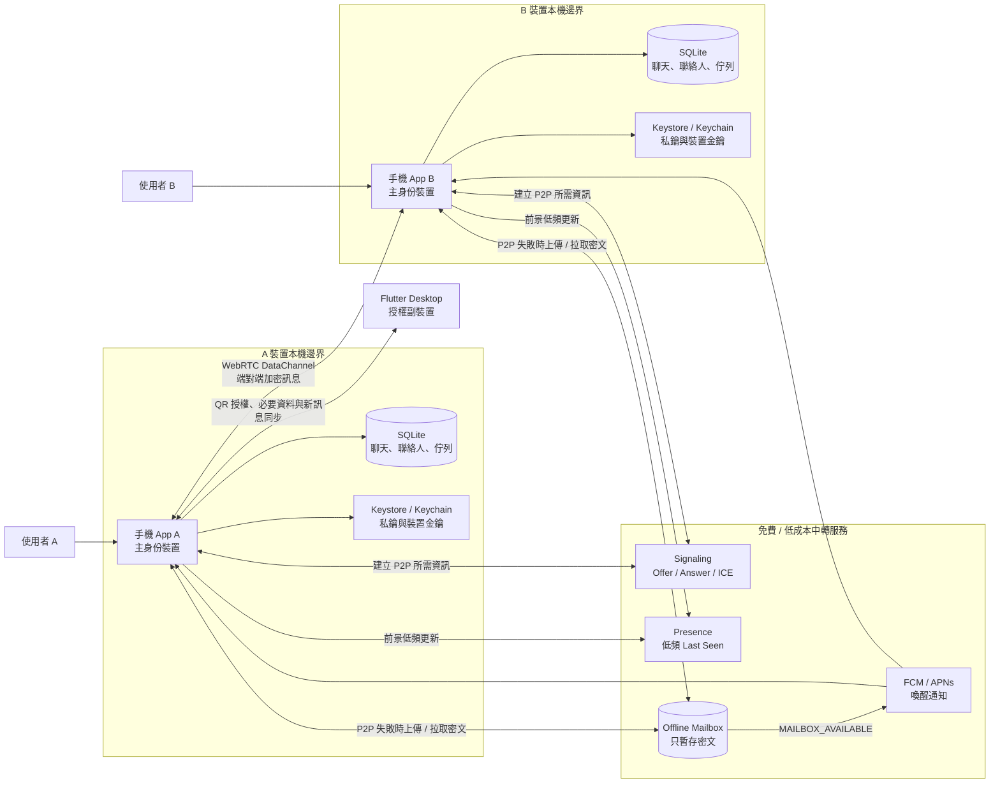
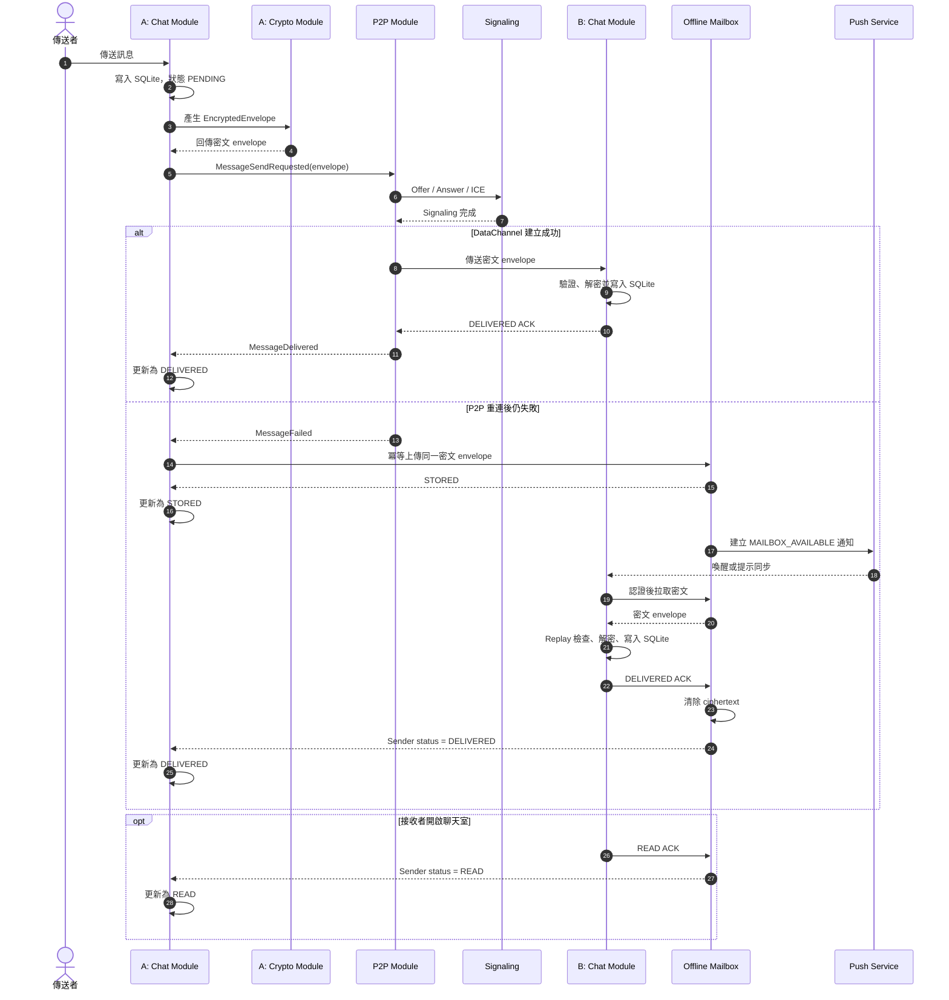
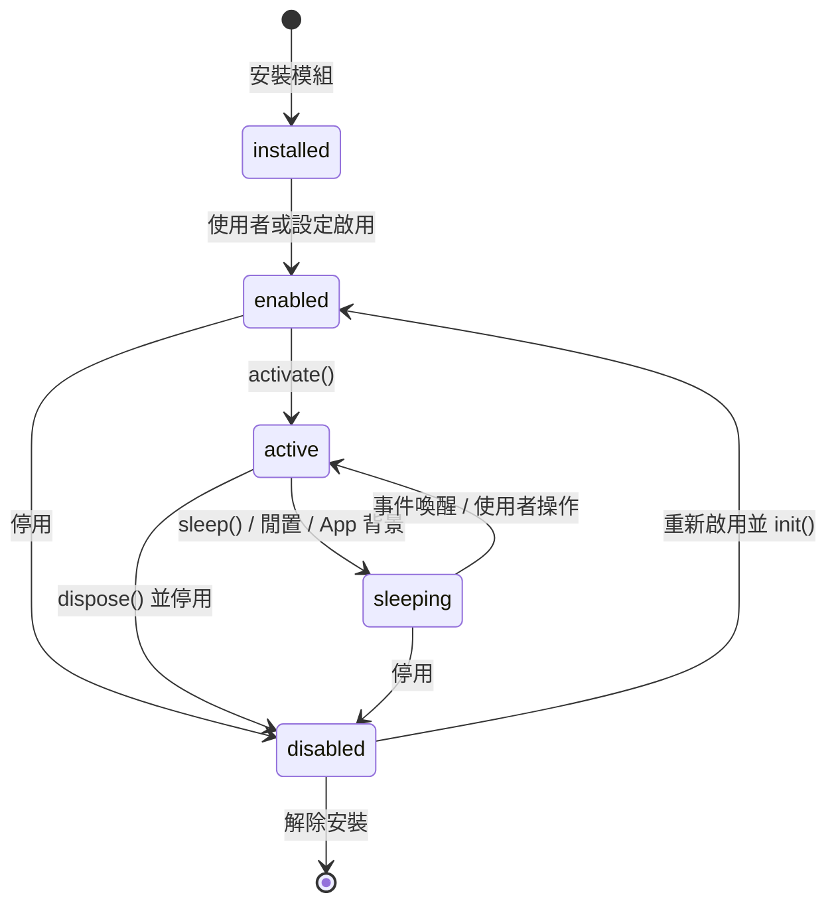
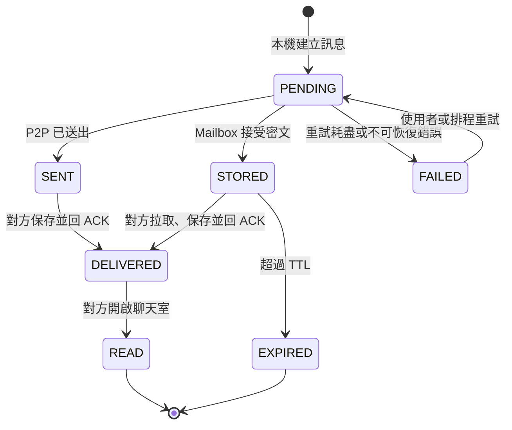

# P2P Modular Messenger UML

本文件將開發總規格 v1.2 的核心架構整理為可由 Mermaid 渲染的 UML 視圖。

## 系統部署圖

## Core 與 Modules 元件圖

```mermaid
flowchart TB
    app["Flutter Application"] --> registry["Module Registry"]

    subgraph core["Core System"]
        registry
        lifecycle["Module Lifecycle"]
        eventBus["Event Bus"]
        routing["Route Registry"]
        di["Dependency Injection"]
        database["Local Database"]
        cryptoService["Crypto Service"]
        networkService["Network Service"]
        storageService["Storage Service"]
        permissionService["Permission Service"]
        loggingService["Logging Service"]
        resourcePolicy["Resource Policy Service"]
    end

    registry --> lifecycle
    registry --> foundation
    registry --> experience
    registry --> security
    registry --> advanced

    subgraph foundation["Foundation Modules"]
        identity["Identity"]
        contacts["Contacts"]
        chat["Chat"]
        p2p["P2P"]
        crypto["Crypto"]
        mailboxModule["Mailbox"]
        notification["Notification"]
        presenceModule["Presence"]
        settings["Settings"]
    end

    subgraph experience["Experience Modules"]
        reaction["Reaction"]
        sticker["Sticker / Creator"]
        voiceMessage["Voice Message"]
        imageMessage["Image Message"]
        translation["Translation"]
        smartNotification["Smart Notification"]
    end

    subgraph security["Device / Security Modules"]
        appLock["App Lock"]
        safetyNumber["Safety Number"]
        lowPower["Low Power Mode"]
        storageManager["Storage Manager"]
        desktopLink["Desktop Link"]
        deviceSync["Device Sync"]
        deviceRevoke["Device Revoke"]
    end

    subgraph advanced["Advanced Modules"]
        fileTransfer["File Transfer"]
        calls["Voice / Video Call"]
        group["Small Group / Broadcast"]
        collaboration["Shared Notes / Todo"]
        ai["Live Caption / Writing Assist / Summary"]
    end

    foundation -. "發布 / 訂閱事件" .-> eventBus
    experience -. "發布 / 訂閱事件" .-> eventBus
    security -. "發布 / 訂閱事件" .-> eventBus
    advanced -. "發布 / 訂閱事件" .-> eventBus

    chat --> database
    p2p --> networkService
    crypto --> cryptoService
    mailboxModule --> networkService
    sticker --> storageService
    calls --> permissionService
    lowPower --> resourcePolicy
    lifecycle --> resourcePolicy
    foundation --> routing
    foundation --> di
    foundation --> loggingService
```

跨模組只透過 Event Bus 與 Core service 契約溝通；Chat Module 不直接依賴 P2P、Sticker 或其他功能模組的內部實作。

## 訊息傳送循序圖

## 模組生命週期狀態圖

高耗能的語音、視訊、檔案與 AI 模組預設為 `disabled` 或 `sleeping`；只有實際使用時才進入 `active`，結束後立即釋放資源。

## 訊息狀態圖

Mailbox 未收到 `DELIVERED` ACK 前不得刪除訊息；收到 ACK 後先清除伺服器端 ciphertext，再保留必要的傳遞狀態供傳送端同步。
